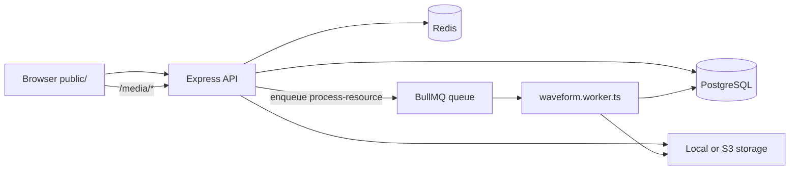
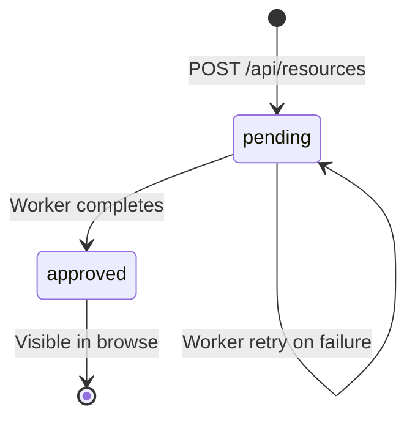

# Developer Guide

Architecture, local development, and operational workflows for Kanjava Music.

## Stack

| Layer | Technology |
|-------|------------|
| API | Node.js 20 + Express + TypeScript |
| DB / ORM | PostgreSQL 16 + Drizzle |
| Search | `pg_trgm` + `tsvector` / `tsquery` |
| Jobs | BullMQ + Redis |
| Storage | Local filesystem (dev) or S3-compatible (prod stub) |
| Client | Vanilla TypeScript + Web Audio API, bundled with esbuild |

## Architecture



### API (`src/index.ts`)

Express app on `PORT` (default 3000). Routes:

| Mount | Router | Purpose |
|-------|--------|---------|
| `/api/health` | inline | Health check |
| `/api/auth` | `auth.routes.ts` | JWT cookie auth |
| `/api/genres` | `catalog.routes.ts` | Genre taxonomy |
| `/api/catalog` | `catalog.routes.ts` | Format categories |
| `/api/bundles` | `bundles.routes.ts` | Bundle listings |
| `/api/resources` | `resources.routes.ts` | Upload, browse, download |
| `/api/producers` | `producers.routes.ts` | Producer profiles |
| `/media/*` | `media.routes.ts` | Stream previews/waveforms |
| `/*` | static + SPA fallback | Serves `public/` |

Environment variables are validated at startup via Zod in `src/config/env.ts`.

### Worker (`src/workers/waveform.worker.ts`)

BullMQ worker on queue `process-resource` (`src/services/queue.ts`):

1. API uploads file → stores original → inserts `pending` resource → enqueues job
2. Worker uses `ffmpeg-static` to transcode preview MP3 (128 kbps) and extract 200-bin waveform peaks JSON
3. For zip/MIDI uploads, uses companion preview audio when provided
4. Updates resource: `previewUrl`, `waveformJsonUrl`, `durationMs`, `status: approved`

Concurrency: 2. Retries: 3 with exponential backoff.

### Database

- ORM client: `src/db/client.ts` (postgres.js + Drizzle)
- Schema: `src/db/schema/` (producers, resources, genres, bundles, downloads, tags, upload agreements)
- Search: FTS + trigram with triggers in `0002_search_vector_trigger.sql`; query logic in `src/services/search.service.ts`
- Extensions: `pg_trgm`, `unaccent` (enabled in `docker/postgres/init.sql` and `0001_init.sql`)

### Redis

Used exclusively for BullMQ (`REDIS_URL`). Connection options in `src/services/queue.ts`.

### Storage (`src/services/storage.service.ts`)

| Driver | Config | Behavior |
|--------|--------|----------|
| `local` (dev) | `STORAGE_LOCAL_PATH` | Files under `originals/`, `previews/`, `waveforms/` |
| `s3` (prod) | S3 env vars | Stub only — throws "not configured" |

**Upload flow** (`src/services/upload.service.ts`):

1. Validate genres, metadata, agreement acceptance
2. SHA-256 dedup check
3. `storage.put()` original (+ optional companion preview)
4. Insert DB rows (resource, genres, tags, upload agreement)
5. Enqueue worker job

**Serving** (`src/routes/media.routes.ts`):

- `previews/` and `waveforms/` → public via `/media/{key}`
- `originals/` → blocked (403); licensed download via API

Public URLs: `{APP_URL}/media/{key}` (local) or `S3_PUBLIC_URL` (S3).

## Directory map

| Path | Purpose |
|------|---------|
| `src/index.ts` | API entry point |
| `src/routes/` | Express route handlers |
| `src/services/` | Business logic (upload, search, catalog, auth, storage, queue) |
| `src/middleware/` | Auth middleware |
| `src/workers/` | BullMQ background workers |
| `src/db/schema/` | Drizzle table definitions |
| `src/db/migrations/` | Hand-written SQL migrations |
| `src/db/migrate.ts` | Migration runner |
| `src/db/seed.ts` | Bundle seed script |
| `src/client/` | Vanilla TS browser app (browse, player, discovery) |
| `public/` | Static assets (`index.html`, CSS, bundled `js/app.js`) |
| `docker/postgres/` | Postgres init SQL (extensions) |
| `docs/` | Project documentation |
| `storage/` | Local file storage (gitignored) |
| `dist/` | Compiled server output (`tsc`) |

`tsconfig.json` excludes `src/client/**/*` from server compilation — the client is bundled separately via esbuild.

## Local development

### Docker (recommended)

Requirements: [Docker Desktop](https://www.docker.com/products/docker-desktop/)

```bash
cp .env.example .env
docker compose up --build
```

| Service | Port | Role |
|---------|------|------|
| `app` | 3000 | migrate → build client → `npm run dev` |
| `worker` | — | `npm run dev:worker` |
| `postgres` | 5432 | DB + extensions |
| `redis` | 6379 | BullMQ |

App startup: `npm install && npm run db:migrate && npm run build:client && npm run dev`

Reset database: `docker compose down -v`

### Without Docker

Requirements: Node 20+, PostgreSQL 16 (with `pg_trgm`), Redis, ffmpeg.

```bash
cp .env.example .env
# Set DATABASE_URL and REDIS_URL for local services

npm install
npm run db:migrate
npm run build:client
npm run dev          # API on :3000
npm run dev:worker   # waveform worker (separate terminal)
```

| Aspect | Docker | Non-Docker |
|--------|--------|------------|
| ffmpeg | In container | Install locally |
| DB/Redis hosts | `postgres`, `redis` | `localhost` |
| Storage | `/app/storage` volume | `./storage` |
| Migrations | Auto on app start | Manual `npm run db:migrate` |
| Client build | Auto on app start | Manual `npm run build:client` |

### Environment variables

See `.env.example` for the full list. Key variables:

| Variable | Purpose |
|----------|---------|
| `DATABASE_URL` | PostgreSQL connection string |
| `REDIS_URL` | Redis for BullMQ |
| `JWT_SECRET` | Min 8 chars; signs auth tokens |
| `STORAGE_DRIVER` | `local` or `s3` |
| `STORAGE_LOCAL_PATH` | Local storage directory |
| `MAX_UPLOAD_BYTES` | Upload size limit (default 500 MB) |
| `AGREEMENT_VERSION` | Producer agreement version (`v1`) |

Do not commit `.env`. See [README secrets policy](../README.md#secrets-policy).

## Migrations

### Apply migrations

```bash
npm run db:migrate
```

Runner (`src/db/migrate.ts`):

1. Creates `schema_migrations` tracking table
2. Reads sorted `*.sql` files from `src/db/migrations/`
3. Applies each unapplied file in a transaction

### Migration files

| File | Contents |
|------|----------|
| `0001_init.sql` | Extensions, enums, producers, resources, tags, downloads |
| `0002_search_vector_trigger.sql` | FTS `search_vector` triggers |
| `0003_catalog_expansion.sql` | Phase 2 types, genres (with seed data), bundles, dual pricing |

### Schema generation (optional)

```bash
npm run db:generate   # drizzle-kit generate from schema
```

Migrations in this project are primarily hand-authored SQL. Use `db:generate` when adding new Drizzle schema definitions, then review and adjust the generated SQL before applying.

## Seeding

| Data | How |
|------|-----|
| Genres | Seeded in `0003_catalog_expansion.sql` |
| Bundles | `npm run db:seed` — creates sample bundles from existing **approved** resources |

Bundle seed is idempotent (checks slug). Requires at least 2 approved resources. No automated seed for producers or sample audio files.

## Upload lifecycle



1. Producer uploads via multipart form → resource created with `status: pending`
2. API returns `202 Accepted`
3. Worker transcodes preview, generates waveform, updates status to `approved`
4. Resource appears in search and discovery UI

## Client build

```bash
npm run build:client
# esbuild src/client/main.ts --bundle --outfile=public/js/app.js --format=esm --sourcemap
```

**Entry:** `src/client/main.ts` — auth, upload forms, search, discovery sections.

**Submodules:**

- `src/client/browse/` — resource grid, cards, genre/format discovery
- `src/client/player/` — Web Audio preview player, waveform renderer

**Output:** `public/js/app.js` (+ `.map`)

**HTML:** `public/index.html` loads `<script type="module" src="/js/app.js">`

**CSS:** `public/css/marketplace.css` (served statically, not bundled)

**Production build:**

```bash
npm run build        # tsc (server) && build:client
npm start            # node dist/index.js
npm run start:worker # node dist/workers/waveform.worker.js
```

## Testing

Vitest (`vitest.config.ts`):

```bash
npm test
npm run test:watch
```

Config: `include: ['src/**/*.test.ts']`, `environment: 'node'`

| Test file | Coverage |
|-----------|----------|
| `catalog-filters.test.ts` | Query param parsers, upload validation |
| `hash.service.test.ts` | SHA-256 hashing, dedup |
| `camelot-compat.test.ts` | Camelot wheel key compatibility |
| `preview-player.test.ts` | Player state machine (no DOM/AudioContext) |

No integration/API tests or E2E browser tests yet.

## npm scripts

| Script | Command |
|--------|---------|
| `dev` | `tsx watch src/index.ts` |
| `dev:worker` | `tsx watch src/workers/waveform.worker.ts` |
| `build` | `tsc && npm run build:client` |
| `build:client` | esbuild → `public/js/app.js` |
| `db:generate` | `drizzle-kit generate` |
| `db:migrate` | `tsx src/db/migrate.ts` |
| `db:seed` | `tsx src/db/seed.ts` |
| `db:studio` | `drizzle-kit studio` |
| `test` | `vitest run` |

## Related docs

- [API Reference](api.md)
- [Producer Upload Guide](producer-upload-guide.md)
- [Phase 2 Catalog](phase2-catalog.md)
- [Project README](../README.md)
